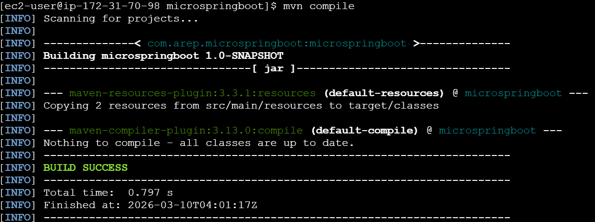
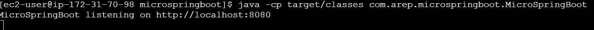
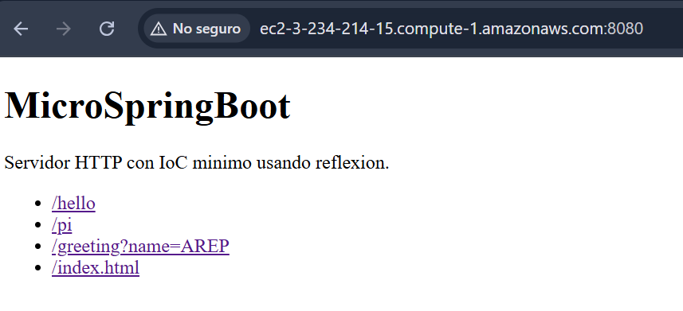
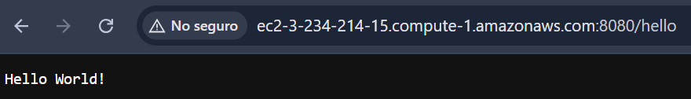
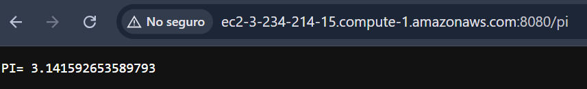
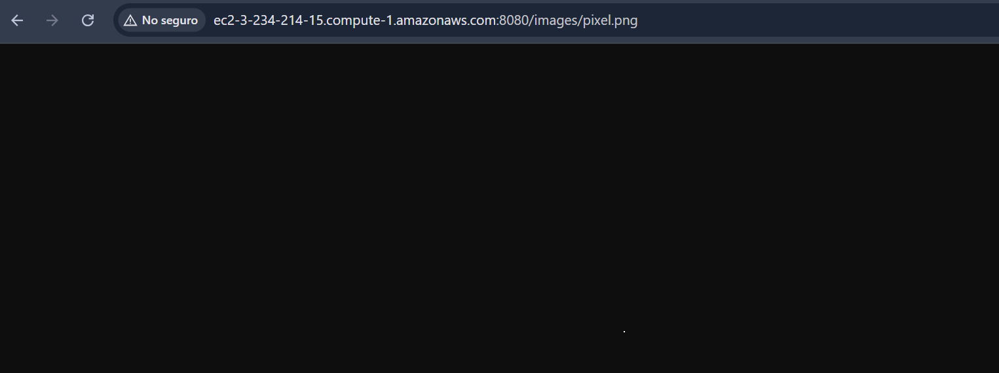

# MicroSpringBoot

Prototipo minimo de un servidor web en Java con un micro-framework IoC basado en reflexion. El proyecto descubre componentes anotados con `@RestController`, registra metodos anotados con `@GetMapping`, resuelve parametros con `@RequestParam` y sirve recursos estaticos desde el classpath.

## Estado actual

La implementacion actual ya cubre una version funcional del laboratorio:

- Define las anotaciones `@RestController` y `@GetMapping`.
- Define la anotacion `@RequestParam`.
- Descubre controladores del paquete base usando reflexion.
- Levanta un servidor HTTP basico con `ServerSocket`.
- Atiende multiples solicitudes no concurrentes.
- Sirve respuestas dinamicas de tipo `String`.
- Sirve archivos estaticos HTML y PNG desde `src/main/resources/static`.
- Incluye los controladores `HelloController` y `GreetingController`.

El proyecto ya puede ejecutarse desde navegador o por peticiones HTTP directas en `http://localhost:8080`.

## Requisitos previos

- Java 17
- Maven 3.9 o superior

## Arquitectura

El proyecto implementa un micro-framework IoC sobre un servidor HTTP propio en Java puro (sin Spring). La arquitectura se organiza en cuatro capas:

```
┌─────────────────────────────────────────────┐
│            Cliente HTTP (browser/curl)      │
└────────────────────┬────────────────────────┘
                     │ HTTP GET
┌────────────────────▼────────────────────────┐
│         Servidor HTTP (MicroSpringBoot)     │
│  ServerSocket + ExecutorService (10 hilos)  │
└────────────────────┬────────────────────────┘
                     │ despacho
        ┌────────────┴────────────┐
        │                        │
┌───────▼────────┐   ┌───────────▼──────────┐
│  Controladores │   │  Recursos estáticos  │
│  (reflexión)   │   │  (classpath /static) │
│ HelloController│   │  index.html, *.png   │
│GreetingControl.│   └──────────────────────┘
└───────┬────────┘
        │ anotaciones
┌───────▼────────────────────────────────────┐
│  @RestController  @GetMapping  @RequestParam│
└─────────────────────────────────────────────┘
```

El servidor acepta solicitudes concurrentemente usando un pool de hilos fijo. Al recibir una petición, busca primero una ruta dinámica registrada; si no la encuentra, intenta servir el recurso estático del classpath. El apagado es elegante: el shutdown hook cierra el `ServerSocket` y espera hasta 10 segundos a que los hilos activos terminen antes de forzar la parada.

## Diseño de clases

| Clase / Anotación | Responsabilidad |
|---|---|
| `MicroSpringBoot` | Punto de entrada. Escanea el paquete base por reflexión, registra rutas y levanta el servidor HTTP con pool de hilos. |
| `@RestController` | Marca una clase POJO como controlador HTTP descubrible por reflexión. |
| `@GetMapping` | Asocia un método a una ruta HTTP GET. |
| `@RequestParam` | Vincula un parámetro del método a un query-param de la URL, con valor por defecto opcional. |
| `HelloController` | Controlador de ejemplo: expone `/`, `/hello` y `/pi`. |
| `GreetingController` | Controlador de ejemplo con `@RequestParam`: expone `/greeting?name=`. |
| `RouteDefinition` (inner) | Agrupa la instancia del controlador, el método y los descriptores de sus parámetros para el despacho. |
| `HttpResponse` (inner) | Encapsula código de estado, content-type y cuerpo de la respuesta. |
| `Configuration` (inner) | Almacena puerto, paquete base y clase de controlador leídos de los argumentos de línea de comandos. |

## Estructura del proyecto

```text
microspringboot/
|-- pom.xml
|-- README.md
|-- src/
|   |-- main/java/com/arep/microspringboot/
|   |   |-- GetMapping.java
|   |   |-- HelloController.java
|   |   |-- GreetingController.java
|   |   |-- MicroSpringBoot.java
|   |   |-- RequestParam.java
|   |   `-- RestController.java
|   |-- main/resources/static/
|   |   |-- index.html
|   |   `-- images/pixel.png
|   `-- test/java/com/arep/microspringboot/
|       `-- AppTest.java
`-- target/
```

## Compilacion

```bash
mvn clean package
```

El proyecto ahora genera un jar ejecutable en:

```text
target/microspringboot-1.0-SNAPSHOT.jar
```

## Ejecucion

Levantar el servidor en el puerto por defecto `8080`:

```bash
mvn compile
java -cp target/classes com.arep.microspringboot.MicroSpringBoot
```

Tambien puedes ejecutarlo como jar:

```bash
java -jar target/microspringboot-1.0-SNAPSHOT.jar
```

## Docker

### Construir la imagen

```bash
docker build -t microspringboot:latest .
```

### Ejecutar un contenedor localmente

```bash
docker run -d -p 8080:8080 --name microspringboot microspringboot:latest
```

Verificar que corre:

```bash
docker ps
curl http://localhost:8080/hello
```

### Subir la imagen a Docker Hub

```bash
docker tag microspringboot:latest <tu-usuario>/microspringboot:latest
docker login
docker push <tu-usuario>/microspringboot:latest
```

### Descargar y ejecutar desde Docker Hub (en cualquier máquina)

```bash
docker run -d -p 8080:8080 --name microspringboot <tu-usuario>/microspringboot:latest
```

### Docker Compose

```bash
docker-compose up -d
docker-compose down
```

## Endpoints disponibles

Dinamicos:

- `/`
- `/hello`
- `/pi`
- `/greeting?name=AREP`

Estaticos:

- `/index.html`
- `/images/pixel.png`

## Ejemplos de uso

```bash
curl http://localhost:8080/hello
curl "http://localhost:8080/greeting?name=AREP"
curl http://localhost:8080/index.html
```

Respuestas esperadas:

- `/hello` responde `Hello World!`
- `/greeting?name=AREP` responde `Hola AREP`
- `/index.html` entrega una pagina HTML de prueba
- `/images/pixel.png` entrega una imagen PNG de prueba

## Controladores de ejemplo

`HelloController` expone la pagina principal, `/hello` y `/pi`.

`GreetingController` demuestra el uso de `@RequestParam`:

```java
@RestController
public class GreetingController {

    @GetMapping("/greeting")
    public String greeting(@RequestParam(value = "name", defaultValue = "World") String name) {
        return "Hola " + name;
    }
}
```

## Pruebas

Para ejecutar las pruebas:

```bash
mvn test
```

Las pruebas actuales validan:

- Resolucion de rutas dinamicas.
- Soporte de `@RequestParam` con y sin valor.
- Entrega de HTML estatico.
- Entrega de PNG estatico.
- Respuesta `404` para recursos inexistentes.

## Alcance logrado frente al taller

Implementado:

- Proyecto estructurado con Maven.
- Servidor HTTP basico en Java.
- Descubrimiento automatico de controladores anotados con `@RestController`.
- Soporte para `@GetMapping`.
- Soporte para `@RequestParam`.
- Entrega de paginas HTML e imagenes PNG.
- Atencion de multiples solicitudes de forma concurrente (pool de 10 hilos).
- Apagado elegante con shutdown hook.
- Aplicacion de ejemplo derivada de POJOs.
- Empaquetado en jar ejecutable para despliegue.

## Despliegue en AWS

Flujo usado para el despliegue en EC2:

1. Ejecutar `mvn clean package` para generar `target/microspringboot-1.0-SNAPSHOT.jar`.
2. Subir el jar a la instancia EC2.
3. Instalar Java 17 en la instancia.
4. Abrir el puerto `8080` en el Security Group.
5. Ejecutar `java -jar microspringboot-1.0-SNAPSHOT.jar`.
6. Validar el acceso desde navegador o con `curl` sobre la IP publica.

## Video

[](images/demomicrospringboot.mp4)

## Evidencias

Las siguientes capturas documentan el proceso de compilacion, despliegue y verificacion de la aplicacion:

### Evidencia 1


### Evidencia 2



### Evidencia 3



### Evidencia 4



### Evidencia 5



### Evidencia 6



## Entrega

Este repositorio queda listo para subir a GitHub con:

- Codigo fuente del micro-framework y del servidor HTTP.
- Recursos estaticos de prueba.
- Pruebas automatizadas con JUnit.
- README con instrucciones de ejecucion y evidencias del despliegue.
